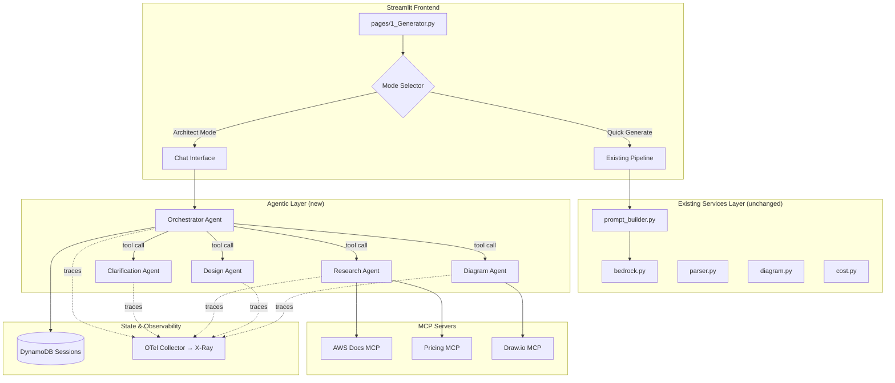
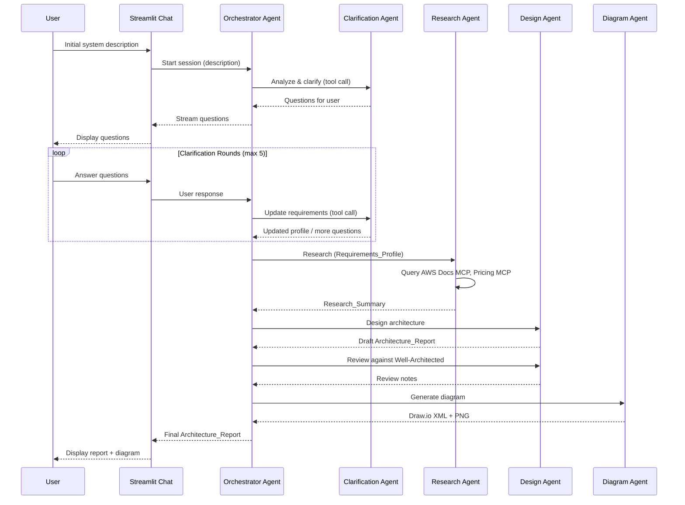
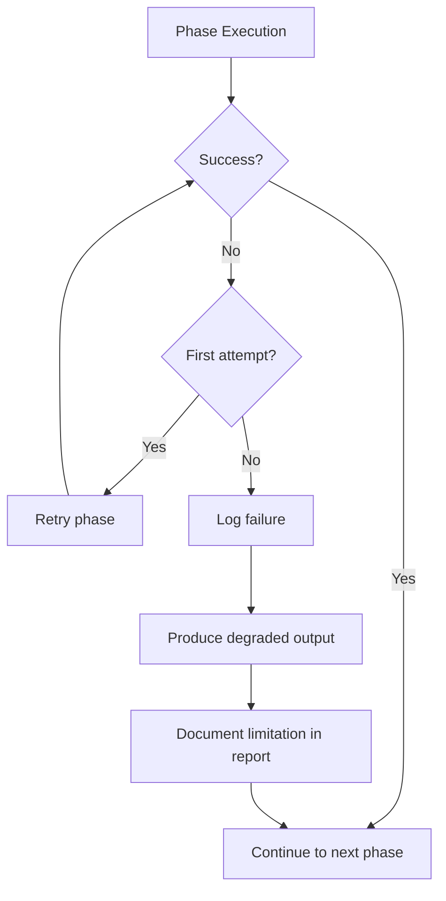

# Design Document

## Overview

The Agentic Architect feature transforms the existing AWS Architect AI from a single-shot prompt-response tool into a multi-turn, conversational AWS Solutions Architect powered by the Strands Agents SDK and deployed on Amazon Bedrock AgentCore. The system uses an "agents-as-tools" orchestration pattern where a top-level Orchestrator Agent delegates to specialized sub-agents (Clarification, Research, Design, Diagram) through the Strands tool interface.

The new agentic layer is introduced as an **additive module** (`agents/`) that sits alongside the existing `services/` layer. The existing Quick Generate pipeline (`prompt_builder → bedrock → parser → diagram`) remains completely untouched. A UI mode selector in the Generator page determines which pipeline is activated.

### Key Design Decisions

| Decision | Rationale |
|----------|-----------|
| Strands "agents-as-tools" pattern | Sub-agents are registered as tools on the Orchestrator, giving natural delegation with typed I/O and automatic context management |
| MCP for external tools (AWS Docs, Pricing, Draw.io) | Standard protocol avoids vendor-specific integrations; MCP servers can be swapped independently |
| AgentCore for production with ECS Fargate fallback | Managed scaling/observability in supported regions, graceful degradation elsewhere |
| Session stored in DynamoDB | Survives container restarts, supports resume-after-inactivity, scales independently |
| Streamlit chat interface via `st.chat_message` | Native Streamlit chat primitives; avoids custom WebSocket complexity |
| Pydantic models for all agent I/O | Consistent validation, serialization, and schema documentation across agents |
| OpenTelemetry via Strands built-in tracing | Strands SDK has native OTel support; X-Ray acts as the collector backend |

## Architecture



### Orchestration Flow



### Dependency Rule

```
pages/ → agents/ → services/ → models/
pages/ → services/ → models/  (Quick Generate path, unchanged)
agents/ → models/
```

The `agents/` module may import from `services/` (e.g., reusing the existing diagram renderer as a fallback) and `models/`. Neither `services/` nor `models/` import from `agents/`.

## Components and Interfaces

### agents/orchestrator.py

The top-level agent that manages workflow phases and delegates to sub-agents.

```python
from strands import Agent
from strands.models import BedrockModel

class OrchestratorAgent:
    """Top-level workflow orchestrator using agents-as-tools pattern."""

    def __init__(self, session_id: str | None = None):
        """Initialize with sub-agents registered as tools.
        
        Args:
            session_id: Optional existing session to resume.
        """
        ...

    async def run(self, user_message: str) -> AsyncIterator[AgentEvent]:
        """Process a user message and yield streaming events.
        
        Args:
            user_message: The user's input text.
            
        Yields:
            AgentEvent objects (text chunks, phase transitions, artifacts).
        """
        ...

    def get_session(self) -> Session:
        """Return the current session state."""
        ...
```

### agents/clarification.py

Handles multi-turn requirements gathering with smart question generation.

```python
from strands import Agent, tool

class ClarificationAgent:
    """Specialized agent for requirements gathering via clarifying questions."""

    def __init__(self):
        ...

    def analyze_and_clarify(
        self, description: str, existing_profile: RequirementsProfile | None = None
    ) -> ClarificationResult:
        """Analyze description and generate clarifying questions.
        
        Args:
            description: User's system description or follow-up answer.
            existing_profile: Previously gathered requirements (for follow-up rounds).
            
        Returns:
            ClarificationResult with questions or a complete RequirementsProfile.
        """
        ...
```

### agents/research.py

Queries MCP servers for AWS documentation and pricing data.

```python
from strands import Agent
from strands.tools.mcp import MCPClient

class ResearchAgent:
    """Agent that researches AWS best practices and pricing via MCP tools."""

    def __init__(self, docs_mcp: MCPClient, pricing_mcp: MCPClient):
        ...

    def research(self, profile: RequirementsProfile) -> ResearchSummary:
        """Conduct research based on requirements profile.
        
        Args:
            profile: The gathered requirements.
            
        Returns:
            ResearchSummary with reference architectures, pricing, and WAF guidance.
        """
        ...
```

### agents/design.py

Produces the architecture design with networking, security, and cost analysis.

```python
from strands import Agent

class DesignAgent:
    """Agent that produces architecture designs from research and requirements."""

    def __init__(self):
        ...

    def design(
        self, profile: RequirementsProfile, research: ResearchSummary
    ) -> ArchitectureReport:
        """Generate a complete architecture design.
        
        Args:
            profile: Requirements from clarification phase.
            research: Research findings from research phase.
            
        Returns:
            Complete ArchitectureReport with all sections.
        """
        ...

    def review(self, report: ArchitectureReport) -> WellArchitectedReview:
        """Review architecture against Well-Architected Framework.
        
        Args:
            report: The draft architecture report.
            
        Returns:
            Review summary with findings per pillar.
        """
        ...
```

### agents/diagram.py

Generates professional diagrams via MCP or falls back to local rendering.

```python
from strands import Agent
from strands.tools.mcp import MCPClient

class DiagramAgent:
    """Agent that generates professional AWS architecture diagrams."""

    def __init__(self, drawio_mcp: MCPClient | None = None):
        ...

    def generate(self, report: ArchitectureReport) -> DiagramResult:
        """Generate Draw.io diagram from architecture report.
        
        Args:
            report: The architecture report containing services and topology.
            
        Returns:
            DiagramResult with Draw.io XML and optional PNG bytes.
        """
        ...
```

### agents/session_store.py

Manages session persistence in DynamoDB.

```python
from models.session import Session

class SessionStore:
    """DynamoDB-backed session persistence."""

    def __init__(self, table_name: str = "architect-sessions"):
        ...

    async def save(self, session: Session) -> None:
        """Persist session state to DynamoDB.
        
        Args:
            session: The session to persist.
        """
        ...

    async def load(self, session_id: str) -> Session | None:
        """Load a session by ID.
        
        Args:
            session_id: The unique session identifier.
            
        Returns:
            Session if found, None otherwise.
        """
        ...

    async def list_sessions(self, user_id: str) -> list[SessionSummary]:
        """List active sessions for a user.
        
        Args:
            user_id: The user identifier.
            
        Returns:
            List of session summaries ordered by last activity.
        """
        ...
```

### agents/mcp_config.py

Configures and provides MCP client instances.

```python
from strands.tools.mcp import MCPClient
from strands.tools.mcp.mcp_client import StdioTransport, StreamableHTTPTransport

def create_docs_mcp() -> MCPClient:
    """Create AWS Documentation MCP client.
    
    Returns:
        Configured MCPClient for AWS documentation queries.
    """
    ...

def create_pricing_mcp() -> MCPClient:
    """Create AWS Pricing MCP client.
    
    Returns:
        Configured MCPClient for pricing data queries.
    """
    ...

def create_drawio_mcp() -> MCPClient:
    """Create Draw.io MCP client.
    
    Returns:
        Configured MCPClient for diagram generation.
    """
    ...
```

### pages/1_Generator.py (modified)

The existing Generator page is extended with a mode selector and chat interface.

```python
def render_generator_page() -> None:
    """Render the Generator page with mode selection."""
    ...

def render_architect_mode() -> None:
    """Render the chat-based Architect Mode interface.
    
    Displays conversation history, streams agent responses,
    shows workflow phase indicator, and renders inline artifacts.
    """
    ...

def render_quick_generate_mode() -> None:
    """Render the existing Quick Generate interface (unchanged logic)."""
    ...
```

### agents/events.py

Defines the event types streamed from agents to the UI.

```python
from enum import Enum
from pydantic import BaseModel

class AgentEventType(str, Enum):
    TEXT_CHUNK = "text_chunk"
    PHASE_TRANSITION = "phase_transition"
    ARTIFACT = "artifact"
    TOOL_CALL = "tool_call"
    ERROR = "error"
    COMPLETE = "complete"

class AgentEvent(BaseModel):
    """Event emitted during agent execution for UI streaming."""
    type: AgentEventType
    data: str | dict
    phase: str | None = None
    timestamp: float
```

## Data Models

### models/session.py

```python
from datetime import datetime
from enum import Enum
from pydantic import BaseModel, Field
import uuid

class WorkflowPhase(str, Enum):
    REQUIREMENTS_ANALYSIS = "requirements_analysis"
    CLARIFICATION = "clarification"
    RESEARCH = "research"
    DESIGN = "design"
    DIAGRAM_GENERATION = "diagram_generation"
    REVIEW = "review"
    FINAL_REPORT = "final_report"
    COMPLETE = "complete"

class ConversationMessage(BaseModel):
    """A single message in the conversation history."""
    role: str = Field(description="'user' or 'assistant'")
    content: str = Field(description="Message content")
    timestamp: datetime = Field(default_factory=datetime.utcnow)
    phase: WorkflowPhase | None = None
    artifacts: list[str] = Field(default_factory=list)

class Session(BaseModel):
    """Complete session state persisted across turns."""
    session_id: str = Field(default_factory=lambda: str(uuid.uuid4()))
    user_id: str = Field(default="default")
    created_at: datetime = Field(default_factory=datetime.utcnow)
    updated_at: datetime = Field(default_factory=datetime.utcnow)
    current_phase: WorkflowPhase = WorkflowPhase.REQUIREMENTS_ANALYSIS
    conversation_history: list[ConversationMessage] = Field(default_factory=list)
    requirements_profile: RequirementsProfile | None = None
    research_summary: ResearchSummary | None = None
    architecture_report: ArchitectureReport | None = None
    clarification_rounds: int = 0
    is_complete: bool = False
```

### models/requirements.py

```python
from pydantic import BaseModel, Field

class TrafficPattern(BaseModel):
    """Expected traffic characteristics."""
    peak_concurrent_users: int | None = None
    requests_per_second: int | None = None
    data_transfer_gb_monthly: float | None = None
    pattern: str = Field(default="steady", description="steady, spiky, periodic, growing")

class ComplianceRequirement(BaseModel):
    """Compliance and regulatory requirements."""
    frameworks: list[str] = Field(default_factory=list, description="e.g., HIPAA, SOC2, GDPR, PCI-DSS")
    data_residency: str | None = None
    encryption_requirements: list[str] = Field(default_factory=list)

class RequirementsProfile(BaseModel):
    """Structured output of the clarification phase."""
    original_description: str
    compute_preference: str | None = Field(default=None, description="serverless, containers, instances, or mixed")
    budget_monthly_usd: float | None = None
    compliance: ComplianceRequirement = Field(default_factory=ComplianceRequirement)
    multi_region: bool = False
    disaster_recovery: str | None = Field(default=None, description="pilot-light, warm-standby, active-active, or none")
    traffic: TrafficPattern = Field(default_factory=TrafficPattern)
    storage_requirements: list[str] = Field(default_factory=list)
    authentication: str | None = Field(default=None, description="cognito, iam, third-party, none")
    high_availability: bool = True
    additional_constraints: list[str] = Field(default_factory=list)
    assumptions: list[str] = Field(default_factory=list, description="Defaults assumed when user skipped clarification")
    target_region: str = Field(default="eu-west-1")
    iac_preference: str | None = Field(default=None, description="terraform, cdk, cloudformation, or none")
```

### models/research.py

```python
from pydantic import BaseModel, Field

class ReferenceArchitecture(BaseModel):
    """An AWS reference architecture relevant to the workload."""
    name: str
    description: str
    url: str | None = None
    relevance: str = Field(description="Why this reference applies")

class ServiceRecommendation(BaseModel):
    """A recommended AWS service with justification."""
    service_name: str
    justification: str
    alternatives: list[str] = Field(default_factory=list)
    pricing_summary: str | None = None
    free_tier_eligible: bool = False
    free_tier_limits: str | None = None

class WellArchitectedGuidance(BaseModel):
    """Well-Architected Framework guidance for a specific pillar."""
    pillar: str
    recommendations: list[str]
    risks: list[str] = Field(default_factory=list)

class PricingComparison(BaseModel):
    """Cost comparison between alternative service options."""
    category: str = Field(description="e.g., 'compute', 'database', 'storage'")
    options: list[dict] = Field(description="Each option: {service, monthly_estimate, notes}")

class ResearchSummary(BaseModel):
    """Complete output of the research phase."""
    reference_architectures: list[ReferenceArchitecture] = Field(default_factory=list)
    service_recommendations: list[ServiceRecommendation] = Field(default_factory=list)
    well_architected_guidance: list[WellArchitectedGuidance] = Field(default_factory=list)
    pricing_comparisons: list[PricingComparison] = Field(default_factory=list)
    data_sources_available: bool = True
    notes: list[str] = Field(default_factory=list)
```

### models/report.py

```python
from pydantic import BaseModel, Field
from models.architecture import (
    SecurityConfig, EstimatedCost, DiagramData, ServiceDetail,
    NetworkingConfig, MonitoringConfig, ScalingConfig
)

class VPCDesign(BaseModel):
    """Complete VPC topology design."""
    cidr_block: str
    public_subnets: list[dict] = Field(description="[{az, cidr, purpose}]")
    private_subnets: list[dict] = Field(description="[{az, cidr, purpose}]")
    nat_gateways: list[str] = Field(default_factory=list)
    internet_gateway: bool = True
    vpc_endpoints: list[dict] = Field(default_factory=list, description="[{service, type}]")
    route_tables: list[dict] = Field(default_factory=list)
    security_groups: list[dict] = Field(default_factory=list, description="[{name, rules}]")
    network_acls: list[dict] = Field(default_factory=list)
    validation_notes: list[str] = Field(default_factory=list)

class CostComparison(BaseModel):
    """Comparison between architectural alternatives."""
    approach_a: str
    approach_a_monthly: str
    approach_b: str
    approach_b_monthly: str
    recommendation: str
    reasoning: str

class ArchitectureRationale(BaseModel):
    """Rationale for a major design decision."""
    decision: str
    chosen_option: str
    alternatives_considered: list[str]
    reasoning: str

class WellArchitectedReview(BaseModel):
    """Review against all six Well-Architected pillars."""
    operational_excellence: list[str] = Field(default_factory=list)
    security: list[str] = Field(default_factory=list)
    reliability: list[str] = Field(default_factory=list)
    performance_efficiency: list[str] = Field(default_factory=list)
    cost_optimization: list[str] = Field(default_factory=list)
    sustainability: list[str] = Field(default_factory=list)
    violations: list[str] = Field(default_factory=list)
    improvement_opportunities: list[str] = Field(default_factory=list)

class ArchitectureReport(BaseModel):
    """Final comprehensive architecture report - Architect Mode output."""
    title: str
    summary: str
    architecture_description: str
    aws_services: list[ServiceDetail]
    networking: NetworkingConfig
    vpc_design: VPCDesign | None = None
    security: SecurityConfig
    scaling: ScalingConfig
    monitoring: MonitoringConfig
    estimated_cost: EstimatedCost
    cost_comparisons: list[CostComparison] = Field(default_factory=list)
    diagram: DiagramData
    recommendations: list[str] = Field(default_factory=list)
    rationale: list[ArchitectureRationale] = Field(default_factory=list)
    well_architected_review: WellArchitectedReview | None = None
    iac_skeleton: str | None = None
    assumptions: list[str] = Field(default_factory=list)
    data_sources_used: list[str] = Field(default_factory=list)
```

### models/clarification.py

```python
from pydantic import BaseModel, Field

class ClarifyingQuestion(BaseModel):
    """A single clarifying question with a suggested default."""
    question: str
    category: str = Field(description="compute, budget, compliance, traffic, storage, auth, ha, dr")
    suggested_default: str | None = None

class ClarificationResult(BaseModel):
    """Output from a clarification round."""
    questions: list[ClarifyingQuestion] = Field(default_factory=list)
    profile: RequirementsProfile | None = None
    is_complete: bool = False
    round_number: int = 1
```


## Correctness Properties

*A property is a characteristic or behavior that should hold true across all valid executions of a system—essentially, a formal statement about what the system should do. Properties serve as the bridge between human-readable specifications and machine-verifiable correctness guarantees.*

### Property 1: Clarifying questions are well-formed and cover required categories

*For any* valid system description, the Clarification Agent's output SHALL contain at least one ClarifyingQuestion for each of the required categories (compute, budget, compliance, traffic, storage, auth, ha, dr) that is not already explicitly answered in the description, AND every question SHALL have a non-null `suggested_default` value.

**Validates: Requirements 1.1, 1.7**

### Property 2: Questions for explicitly stated requirements are omitted

*For any* system description that explicitly states information for a subset of requirement categories, the Clarification Agent SHALL NOT generate questions for those already-answered categories, while still generating questions for the remaining categories.

**Validates: Requirements 1.2**

### Property 3: Profile update preserves all user answers

*For any* RequirementsProfile and any set of user answers to clarifying questions, updating the profile with those answers SHALL result in a profile where every answered field matches the corresponding user answer (round-trip between answers and profile fields).

**Validates: Requirements 1.3**

### Property 4: Skip-intent triggers defaults with documented assumptions

*For any* string expressing skip intent (variations of "skip", "just generate", "go ahead", or equivalent), the Clarification Agent SHALL produce a RequirementsProfile with `is_complete=True` and a non-empty `assumptions` list documenting all defaulted values.

**Validates: Requirements 1.5**

### Property 5: Clarification rounds never exceed maximum

*For any* sequence of user responses during clarification, the `clarification_rounds` counter SHALL never exceed 5, and after 5 rounds the phase SHALL transition to research regardless of completeness.

**Validates: Requirements 1.6**

### Property 6: Session state accumulates correctly across turns

*For any* sequence of conversation turns within a session, the Session object SHALL contain: all messages in `conversation_history` in chronological order, the current `workflow_phase` matching the latest transition, and non-null `requirements_profile` after clarification completes.

**Validates: Requirements 2.1**

### Property 7: Workflow phases follow required ordering

*For any* completed workflow execution, the sequence of `WorkflowPhase` transitions SHALL be a subsequence of [REQUIREMENTS_ANALYSIS, CLARIFICATION, RESEARCH, DESIGN, DIAGRAM_GENERATION, REVIEW, FINAL_REPORT, COMPLETE] — no phase shall appear before its predecessor in this ordering.

**Validates: Requirements 8.1**

### Property 8: Pricing comparison includes all candidate alternatives

*For any* set of candidate services being compared, the resulting PricingComparison output SHALL contain cost entries for every service in the candidate set, with no service omitted.

**Validates: Requirements 4.2**

### Property 9: Cost estimates are derived from profile traffic and storage values

*For any* RequirementsProfile with specified traffic patterns and storage volumes, the computed monthly cost estimates SHALL reference the profile's `traffic.requests_per_second`, `traffic.data_transfer_gb_monthly`, or storage values — costs SHALL NOT be zero when non-zero traffic is specified.

**Validates: Requirements 4.4**

### Property 10: Every selected service has a documented justification

*For any* ArchitectureReport, every entry in `aws_services` SHALL have at least one corresponding entry in `rationale` that references that service and provides justification based on pricing, performance, compliance, or Well-Architected alignment.

**Validates: Requirements 5.1, 5.5**

### Property 11: Architecture respects budget constraints

*For any* RequirementsProfile with a non-null `budget_monthly_usd`, the ArchitectureReport's `estimated_cost.total_monthly` (parsed as a numeric value) SHALL NOT exceed the specified budget, OR the report SHALL contain a documented trade-off explanation in the rationale.

**Validates: Requirements 5.3**

### Property 12: VPC design is complete and follows security checklist

*For any* ArchitectureReport where `vpc_design` is not None, the VPC_Design SHALL satisfy: (a) `cidr_block` is a valid CIDR notation, (b) `public_subnets` and `private_subnets` span at least 2 availability zones, (c) `security_groups` is non-empty with no rule allowing 0.0.0.0/0 on non-public ports, (d) `network_acls` is non-empty, (e) `nat_gateways` has at least one entry per AZ when high availability is required, and (f) no database service appears in public subnet definitions.

**Validates: Requirements 6.1, 6.2, 6.3, 6.6**

### Property 13: Fully serverless architectures omit VPC design

*For any* RequirementsProfile with `compute_preference="serverless"` AND an ArchitectureReport containing only serverless services (Lambda, API Gateway, DynamoDB, S3, Step Functions, EventBridge), the `vpc_design` field SHALL be None.

**Validates: Requirements 6.5**

### Property 14: Generated diagram XML is well-formed and parseable

*For any* ArchitectureReport with a non-empty `diagram.nodes` list, the Diagram Agent's output SHALL be well-formed XML that parses without error, contains an `mxGraphModel` root element, and contains at least one `mxCell` element per node.

**Validates: Requirements 7.4**

### Property 15: Final report contains all required sections

*For any* completed workflow, the ArchitectureReport SHALL have: non-empty `title`, non-empty `summary`, non-empty `aws_services`, non-empty `security.recommendations`, `cost_comparisons` with at least 2 entries, non-empty `diagram.nodes`, and non-null `well_architected_review`.

**Validates: Requirements 8.4, 12.1, 12.2, 12.3, 12.4**

### Property 16: IaC skeleton is included when preference is specified

*For any* RequirementsProfile where `iac_preference` is not None, the corresponding ArchitectureReport SHALL have a non-null and non-empty `iac_skeleton` field.

**Validates: Requirements 12.5**

### Property 17: Architecture report serialization round-trip

*For any* valid ArchitectureReport instance, serializing to JSON via `model_dump_json()` and deserializing back via `model_validate_json()` SHALL produce an object that is field-by-field equal to the original.

**Validates: Requirements 12.6**

### Property 18: Messages during non-interactive phases are queued

*For any* user message sent while `current_phase` is RESEARCH, DESIGN, DIAGRAM_GENERATION, or REVIEW, the message SHALL be stored in a queue and delivered to the agent only when the next interactive phase begins or the workflow completes.

**Validates: Requirements 13.6**

### Property 19: ArchitectureReport is backward-compatible with ArchitectureModel

*For any* valid ArchitectureReport, extracting only the fields defined in the existing ArchitectureModel schema SHALL produce a valid ArchitectureModel instance (the new model is a strict superset of the old).

**Validates: Requirements 14.5**

## Error Handling

### Error Categories

| Error Type | Source | User Message | Recovery |
|-----------|--------|--------------|----------|
| `MCPConnectionError` | MCP client timeout/failure | "Research tools are temporarily unavailable. Proceeding with built-in knowledge." | Graceful degradation: agent continues without MCP data |
| `MCPToolError` | MCP server returns error | "Unable to retrieve [pricing/docs]. Using estimated data." | Log error, use fallback data, document limitation |
| `SessionPersistenceError` | DynamoDB write failure | (Silent to user) | Retry once, log, continue in-memory |
| `SessionLoadError` | DynamoDB read failure | "Unable to resume previous session. Starting fresh." | Create new session |
| `AgentTimeoutError` | Sub-agent exceeds 60s | "This phase is taking longer than expected. Retrying..." | Retry phase once, then skip with degraded output |
| `PhaseFailureError` | Any phase fails twice | "Some analysis was limited. See report notes for details." | Skip phase, document limitation in report |
| `BedrockConnectionError` | Bedrock API unreachable | "Unable to connect to AI service. Please try again." | No recovery (blocking) |
| `BedrockThrottlingError` | Rate limited | "Service is busy. Retrying in a few seconds..." | Exponential backoff (3 retries) |
| `StreamingError` | WebSocket/SSE failure | "Connection interrupted. Reconnecting..." | Auto-reconnect, replay from last checkpoint |
| `ValidationError` | Invalid agent output schema | (Silent to user, retry) | Re-invoke agent with stricter prompt |

### Error Handling Strategy

```python
class AgenticArchitectError(Exception):
    """Base exception for the agentic layer."""
    pass

class MCPConnectionError(AgenticArchitectError):
    """MCP server connection failed."""
    def __init__(self, server_name: str, original_error: Exception):
        self.server_name = server_name
        self.original_error = original_error
        super().__init__(f"MCP server '{server_name}' unavailable: {original_error}")

class PhaseFailureError(AgenticArchitectError):
    """A workflow phase failed after retry."""
    def __init__(self, phase: str, attempts: int, last_error: Exception):
        self.phase = phase
        self.attempts = attempts
        super().__init__(f"Phase '{phase}' failed after {attempts} attempts")

class SessionPersistenceError(AgenticArchitectError):
    """Failed to persist session to DynamoDB."""
    pass

class AgentTimeoutError(AgenticArchitectError):
    """Agent execution exceeded timeout."""
    def __init__(self, agent_name: str, timeout_seconds: int):
        self.agent_name = agent_name
        super().__init__(f"Agent '{agent_name}' timed out after {timeout_seconds}s")
```

### Retry and Degradation Strategy



Key principles:
- **MCP failures** → graceful degradation (proceed without external data, use built-in knowledge)
- **Agent timeout** → retry once with simplified prompt, then proceed with partial results
- **Session persistence** → retry once, then continue in-memory (session may be lost on container restart)
- **Bedrock errors** → propagate to user with clear message (no silent degradation for core LLM)
- **All errors** → structured logging with OTel trace context for debugging

## Testing Strategy

### Test Framework and Tools

- **pytest** — test runner and assertions
- **pytest-asyncio** — async test support for streaming agents
- **hypothesis** — property-based testing library (Python)
- **pydantic** — model generation for Hypothesis via `from_model` strategies
- **unittest.mock / pytest-mock** — mocking MCP servers, Bedrock, DynamoDB
- **moto** — AWS service mocking (DynamoDB, X-Ray)
- **xml.etree.ElementTree** — XML validation in diagram tests

### Dual Testing Approach

**Unit tests (example-based):**
- Specific agent behaviors with concrete inputs
- Error handling scenarios (MCP failures, timeouts)
- UI mode switching logic
- Session CRUD operations

**Property tests (Hypothesis):**
- Universal properties across all valid inputs
- Structural invariants on agent outputs
- State machine properties (phase ordering)
- Serialization round-trips
- Model compatibility

### Property-Based Testing Configuration

```python
from hypothesis import given, settings, HealthCheck
from hypothesis import strategies as st

PROPERTY_SETTINGS = settings(
    max_examples=100,
    suppress_health_check=[HealthCheck.too_slow],
    deadline=None  # Agent calls can be slow with mocks
)
```

**Tag format:**
```python
# Feature: agentic-architect, Property 1: Clarifying questions are well-formed and cover required categories
```

### Property Test Mapping

| Property | Module Under Test | Generator Strategy |
|----------|------------------|--------------------|
| Property 1: Question completeness | `agents/clarification.py` | Random system descriptions (1-5000 chars) |
| Property 2: Question filtering | `agents/clarification.py` | Descriptions with embedded category answers |
| Property 3: Profile update | `models/requirements.py` | Random RequirementsProfile + answer dicts |
| Property 4: Skip-intent | `agents/clarification.py` | Random skip-intent phrases |
| Property 5: Max rounds | `agents/orchestrator.py` | Random answer sequences (1-10 rounds) |
| Property 6: Session accumulation | `models/session.py` | Random message sequences |
| Property 7: Phase ordering | `agents/orchestrator.py` | Random phase transition sequences |
| Property 8: Pricing coverage | `agents/research.py` | Random service candidate sets |
| Property 9: Cost from profile | `agents/research.py` | Random TrafficPattern instances |
| Property 10: Service justification | `models/report.py` | Random ArchitectureReport instances |
| Property 11: Budget compliance | `agents/design.py` | Random profiles with budgets |
| Property 12: VPC validity | `models/report.py` | Random VPCDesign instances |
| Property 13: Serverless no VPC | `agents/design.py` | Serverless-only profiles |
| Property 14: Diagram XML | `agents/diagram.py` | Random DiagramData instances |
| Property 15: Report completeness | `models/report.py` | Random ArchitectureReport instances |
| Property 16: IaC conditional | `agents/design.py` | Profiles with iac_preference set |
| Property 17: Report round-trip | `models/report.py` | `from_model(ArchitectureReport)` |
| Property 18: Message queuing | `agents/orchestrator.py` | Random messages during non-interactive phases |
| Property 19: Backward compat | `models/report.py` | Random ArchitectureReport instances |

### Integration Tests

| Scenario | Components | Verification |
|----------|-----------|--------------|
| Full workflow happy path | All agents + mocked MCP | Complete report generated with all sections |
| MCP fallback (docs unavailable) | Research Agent + failing MCP | Report notes "external docs unavailable" |
| MCP fallback (pricing unavailable) | Research Agent + failing MCP | Costs labeled as "estimates" |
| Diagram MCP fallback | Diagram Agent + failing MCP | Falls back to local XML generation |
| Session resume | SessionStore + DynamoDB mock | Session loads and continues from correct phase |
| Quick Generate isolation | Generator page in QG mode | No agent classes instantiated |
| Streaming events | Orchestrator → UI | Events arrive in correct order with phase labels |

### Test Directory Structure

```
tests/
├── unit/
│   ├── test_clarification.py
│   ├── test_research.py
│   ├── test_design.py
│   ├── test_diagram_agent.py
│   ├── test_session_store.py
│   └── test_events.py
├── property/
│   ├── test_prop_clarification.py
│   ├── test_prop_requirements_profile.py
│   ├── test_prop_report_structure.py
│   ├── test_prop_vpc_design.py
│   ├── test_prop_session_state.py
│   ├── test_prop_phase_ordering.py
│   ├── test_prop_serialization.py
│   └── test_prop_backward_compat.py
└── integration/
    ├── test_full_workflow.py
    ├── test_mcp_fallbacks.py
    ├── test_session_persistence.py
    └── test_mode_switching.py
```
