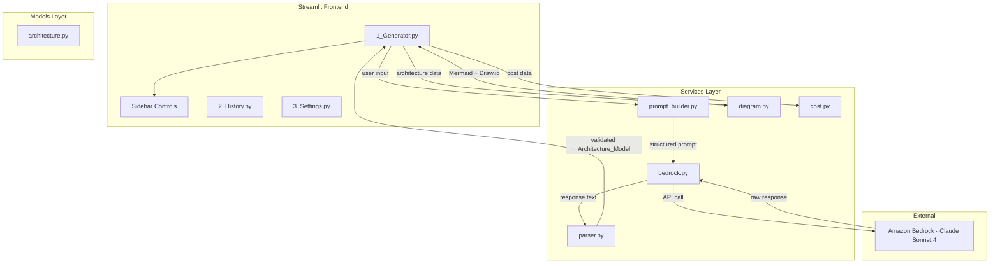
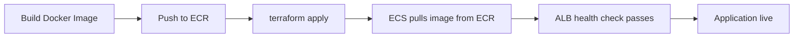

# Design Document

## Overview

AWS Architect AI is a multi-page Streamlit application that translates natural language system descriptions into production-ready AWS architectures. It leverages Amazon Bedrock (Claude Sonnet 4) to generate structured architecture data, then locally converts that data into visual diagrams (Mermaid and Draw.io), cost estimates, and exportable artifacts.

The application follows clean architecture principles with clear separation between UI (pages/), business logic (services/), data structures (models/), and utilities (utils/). It runs as a Docker container on ECS Fargate with JSON-structured logging to stdout for CloudWatch integration.

### Key Design Decisions

| Decision | Rationale |
|----------|-----------|
| Local diagram generation from JSON | Ensures consistent, parseable diagrams regardless of LLM output variability |
| Pydantic for response validation | Provides strict schema enforcement and serialization guarantees |
| Session-based history (st.session_state) | Avoids external database dependency; suitable for single-user copilot |
| boto3 client caching | Prevents repeated client initialization overhead per request |
| Streamlit multi-page convention | Native navigation without custom routing logic |
| JSON structured logging to stdout | Direct compatibility with ECS Fargate awslogs driver |

## Architecture



### Request Flow

1. User enters a system description on the Generator page
2. Generator validates input (non-empty, ≤5000 chars)
3. Prompt_Builder constructs a structured prompt from the description + template
4. Bedrock_Client sends the prompt to Amazon Bedrock with configured temperature
5. Response_Parser extracts JSON from the LLM response text
6. Response_Parser validates JSON against Architecture_Model (Pydantic)
7. Diagram_Renderer converts nodes/connections to Mermaid and Draw.io locally
8. Generator displays results in tabbed sections
9. Architecture is appended to session history

### Dependency Rule

```
pages/ → services/ → models/
pages/ → models/
```

The `services/` and `models/` modules NEVER import from `pages/`. Data flows upward through return values and Pydantic model instances.

## Components and Interfaces

### pages/1_Generator.py

The main generation page. Orchestrates the full flow from user input to display.

```python
def render_generator_page() -> None:
    """Render the Generator page with sidebar controls and main content area."""
    ...

def handle_generate(description: str, temperature: float, model_id: str) -> None:
    """Validate input, trigger generation pipeline, and display results."""
    ...

def display_results(architecture: ArchitectureModel) -> None:
    """Render architecture data in tabbed sections."""
    ...
```

### pages/2_History.py

Displays session-based generation history.

```python
def render_history_page() -> None:
    """Render the History page showing past generations."""
    ...
```

### pages/3_Settings.py

Shows read-only configuration values.

```python
def render_settings_page() -> None:
    """Render the Settings page with current configuration values."""
    ...
```

### services/prompt_builder.py

Constructs prompts from user input and a Markdown template.

```python
def build_prompt(system_description: str) -> str:
    """
    Build a structured prompt requesting architecture JSON.
    
    Args:
        system_description: Natural language description from the user.
    
    Returns:
        Complete prompt string for submission to Bedrock.
    """
    ...
```

### services/bedrock.py

Manages communication with Amazon Bedrock.

```python
import boto3
from functools import lru_cache

@lru_cache(maxsize=1)
def get_bedrock_client(region: str, profile: str | None = None) -> Any:
    """
    Get or create a cached Bedrock runtime client.
    
    Args:
        region: AWS region name.
        profile: Optional AWS profile name.
    
    Returns:
        boto3 Bedrock runtime client instance.
    """
    ...

def invoke_model(
    prompt: str,
    model_id: str,
    temperature: float,
    timeout: int = 60
) -> str:
    """
    Send a prompt to Amazon Bedrock and return the response text.
    
    Args:
        prompt: The complete prompt string.
        model_id: Bedrock model identifier.
        temperature: Generation temperature (0.0-1.0).
        timeout: Request timeout in seconds.
    
    Returns:
        Raw response text from the model.
    
    Raises:
        BedrockTimeoutError: If the request exceeds timeout.
        BedrockConnectionError: If connection to Bedrock fails.
        BedrockThrottlingError: If the request is throttled.
    """
    ...
```

### services/parser.py

Extracts and validates JSON from LLM responses.

```python
def extract_json(response_text: str) -> str:
    """
    Extract the first complete JSON object from response text.
    
    Locates outermost matching curly braces, ignoring any surrounding text.
    
    Args:
        response_text: Raw text from LLM response.
    
    Returns:
        JSON string extracted from the response.
    
    Raises:
        JsonExtractionError: If no complete JSON object is found.
    """
    ...

def parse_architecture(json_str: str) -> ArchitectureModel:
    """
    Parse and validate JSON string against the Architecture model.
    
    Args:
        json_str: Raw JSON string to parse.
    
    Returns:
        Validated ArchitectureModel instance.
    
    Raises:
        ValidationError: If JSON doesn't conform to schema.
    """
    ...
```

### services/diagram.py

Converts architecture JSON nodes/connections to diagram formats.

```python
def to_mermaid(nodes: list[DiagramNode], connections: list[DiagramConnection]) -> str:
    """
    Convert nodes and connections to Mermaid flowchart syntax.
    
    Args:
        nodes: List of diagram nodes with id, label, aws_service.
        connections: List of connections with source_id, target_id, optional label.
    
    Returns:
        Mermaid flowchart code string.
    """
    ...

def to_drawio_xml(nodes: list[DiagramNode], connections: list[DiagramConnection]) -> str:
    """
    Convert nodes and connections to Draw.io mxGraphModel XML.
    
    Args:
        nodes: List of diagram nodes.
        connections: List of connections.
    
    Returns:
        Well-formed Draw.io XML string.
    """
    ...

def parse_mermaid(mermaid_code: str) -> tuple[list[DiagramNode], list[DiagramConnection]]:
    """
    Parse Mermaid flowchart code back into nodes and connections.
    
    Args:
        mermaid_code: Mermaid flowchart syntax string.
    
    Returns:
        Tuple of (nodes, connections) extracted from the Mermaid code.
    """
    ...
```

### services/cost.py

Formats cost breakdown data for display.

```python
def format_cost_summary(estimated_cost: EstimatedCost) -> CostSummary:
    """
    Format cost estimation data for UI display.
    
    Args:
        estimated_cost: Cost data from the architecture model.
    
    Returns:
        Formatted cost summary with total and per-service breakdown.
    """
    ...
```

### utils/logging.py

Configures JSON-structured logging.

```python
def setup_logging(log_level: str = "INFO") -> None:
    """
    Configure JSON-formatted structured logging to stdout.
    
    Args:
        log_level: Log level string (DEBUG, INFO, WARNING, ERROR).
    """
    ...
```

### utils/config.py

Loads and validates environment configuration.

```python
from pydantic import BaseModel

class AppConfig(BaseModel):
    """Application configuration loaded from environment variables."""
    aws_region: str
    bedrock_model_id: str
    aws_profile: str | None = None
    log_level: str = "INFO"

def load_config() -> AppConfig:
    """
    Load configuration from environment variables.
    
    Returns:
        Validated AppConfig instance.
    
    Raises:
        ConfigurationError: If required variables are missing.
    """
    ...
```

### utils/export.py

Handles file export and filename sanitization.

```python
def sanitize_filename(title: str) -> str:
    """
    Sanitize architecture title for use in filenames.
    
    Replaces spaces and special characters with underscores.
    
    Args:
        title: Raw architecture title string.
    
    Returns:
        Sanitized filename-safe string.
    """
    ...

def generate_export_filename(title: str, format_name: str, extension: str) -> str:
    """
    Generate export filename in format: {sanitized_title}_{format}.{extension}
    
    Args:
        title: Architecture title.
        format_name: Export format identifier (e.g., "mermaid", "drawio").
        extension: File extension without dot.
    
    Returns:
        Complete filename string.
    """
    ...
```

## Data Models

### models/architecture.py

```python
from pydantic import BaseModel, Field

class DiagramNode(BaseModel):
    """A single node in the architecture diagram."""
    id: str = Field(description="Unique node identifier")
    label: str = Field(description="Display label for the node")
    aws_service: str = Field(description="AWS service type (e.g., 'EC2', 'S3', 'Lambda')")

class DiagramConnection(BaseModel):
    """A connection between two diagram nodes."""
    source_id: str = Field(description="ID of the source node")
    target_id: str = Field(description="ID of the target node")
    label: str | None = Field(default=None, description="Optional connection label")

class ServiceDetail(BaseModel):
    """Details for a single AWS service in the architecture."""
    name: str = Field(description="AWS service name")
    role: str = Field(description="Role/purpose in the architecture")

class SecurityConfig(BaseModel):
    """Security configuration details."""
    iam_policies: list[str] = Field(default_factory=list)
    encryption: list[str] = Field(default_factory=list)
    cloudtrail: list[str] = Field(default_factory=list)
    waf_rules: list[str] = Field(default_factory=list)
    recommendations: list[str] = Field(default_factory=list)

class ServiceCost(BaseModel):
    """Cost estimate for a single service."""
    service: str = Field(description="AWS service name")
    monthly_cost: str = Field(description="Estimated monthly cost string")

class EstimatedCost(BaseModel):
    """Total cost estimation with per-service breakdown."""
    total_monthly: str = Field(description="Total estimated monthly cost")
    breakdown: list[ServiceCost] = Field(default_factory=list)

class NetworkingConfig(BaseModel):
    """Networking configuration details."""
    vpc: str = Field(default="")
    subnets: list[str] = Field(default_factory=list)
    security_groups: list[str] = Field(default_factory=list)
    load_balancers: list[str] = Field(default_factory=list)

class ScalingConfig(BaseModel):
    """Auto-scaling configuration details."""
    strategy: str = Field(default="")
    policies: list[str] = Field(default_factory=list)

class MonitoringConfig(BaseModel):
    """Monitoring and observability configuration."""
    cloudwatch_metrics: list[str] = Field(default_factory=list)
    alarms: list[str] = Field(default_factory=list)
    dashboards: list[str] = Field(default_factory=list)

class DiagramData(BaseModel):
    """Structured diagram representation with nodes and connections."""
    nodes: list[DiagramNode] = Field(default_factory=list)
    connections: list[DiagramConnection] = Field(default_factory=list)

class ArchitectureModel(BaseModel):
    """Complete architecture response from the LLM."""
    title: str = Field(description="Architecture title")
    summary: str = Field(description="Brief architecture summary")
    architecture_description: str = Field(description="Detailed architecture description")
    aws_services: list[ServiceDetail] = Field(description="List of AWS services used")
    networking: NetworkingConfig = Field(description="Networking configuration")
    security: SecurityConfig = Field(description="Security configuration")
    scaling: ScalingConfig = Field(description="Scaling configuration")
    monitoring: MonitoringConfig = Field(description="Monitoring configuration")
    estimated_cost: EstimatedCost = Field(description="Cost estimation")
    diagram: DiagramData = Field(description="Structured diagram nodes and connections")
    recommendations: list[str] = Field(default_factory=list, description="Architecture recommendations")
```

### CostSummary (utils output model)

```python
class CostSummary(BaseModel):
    """Formatted cost data for UI display."""
    total_monthly: str
    services: list[ServiceCost]
```

### AppConfig (utils/config.py)

```python
class AppConfig(BaseModel):
    """Application configuration from environment variables."""
    aws_region: str
    bedrock_model_id: str
    aws_profile: str | None = None
    log_level: str = "INFO"
```


## Infrastructure and Deployment

### Docker

The application is containerized using a multi-stage Dockerfile for minimal image size:

```dockerfile
# Dockerfile
FROM python:3.12-slim AS base

WORKDIR /app

# Install dependencies
COPY requirements.txt .
RUN pip install --no-cache-dir -r requirements.txt

# Copy application code
COPY . .

# Expose Streamlit port
EXPOSE 8501

# Health check for ECS
HEALTHCHECK --interval=30s --timeout=5s --start-period=10s --retries=3 \
    CMD curl -f http://localhost:8501/_stcore/health || exit 1

# Run Streamlit
ENTRYPOINT ["streamlit", "run", "app.py", "--server.port=8501", "--server.address=0.0.0.0"]
```

### Streamlit Configuration

```toml
# .streamlit/config.toml
[server]
address = "0.0.0.0"
port = 8501
headless = true
enableCORS = false
enableXsrfProtection = true

[browser]
gatherUsageStats = false

[theme]
primaryColor = "#FF9900"
```

### Terraform Infrastructure

The deployment uses Terraform to provision all AWS resources for ECS Fargate hosting.

#### Module Structure

```
infra/
├── main.tf              # Root module, provider config
├── variables.tf         # Input variables
├── outputs.tf           # Stack outputs
├── terraform.tfvars     # Variable values (gitignored, example provided)
├── terraform.tfvars.example
├── modules/
│   ├── networking/      # VPC, subnets, security groups
│   │   ├── main.tf
│   │   ├── variables.tf
│   │   └── outputs.tf
│   ├── ecs/             # ECS cluster, task definition, service
│   │   ├── main.tf
│   │   ├── variables.tf
│   │   └── outputs.tf
│   ├── alb/             # Application Load Balancer
│   │   ├── main.tf
│   │   ├── variables.tf
│   │   └── outputs.tf
│   ├── ecr/             # ECR repository
│   │   ├── main.tf
│   │   ├── variables.tf
│   │   └── outputs.tf
│   └── iam/             # IAM roles and policies
│       ├── main.tf
│       ├── variables.tf
│       └── outputs.tf
```

#### Key Terraform Resources

**Networking Module:**
- VPC with public and private subnets across 2 AZs
- NAT Gateway for private subnet internet access
- Security groups: ALB (inbound 80/443), ECS tasks (inbound from ALB on 8501)

**ECR Module:**
- ECR repository for the application Docker image
- Lifecycle policy to retain last 5 images

**ECS Module:**
- ECS Cluster with Fargate capacity provider
- Task Definition:
  - CPU: 512 (0.5 vCPU)
  - Memory: 1024 MB
  - Container port: 8501
  - Environment variables: `AWS_REGION`, `BEDROCK_MODEL_ID`, `LOG_LEVEL`
  - Log configuration: awslogs driver → CloudWatch Logs
  - Health check: `curl -f http://localhost:8501/_stcore/health`
- ECS Service:
  - Desired count: 1 (single-user copilot)
  - Deployment: rolling update (min 100%, max 200%)
  - Network: private subnets, security group
  - Load balancer target group attachment

**ALB Module:**
- Application Load Balancer in public subnets
- Target group with health check on `/_stcore/health`
- HTTP listener on port 80 (forwards to target group)
- Optional HTTPS listener on port 443 (if certificate ARN provided)

**IAM Module:**
- ECS Task Execution Role: ECR pull, CloudWatch Logs
- ECS Task Role: `bedrock:InvokeModel` permission scoped to the configured model
- Policy document:

```hcl
data "aws_iam_policy_document" "bedrock_invoke" {
  statement {
    effect    = "Allow"
    actions   = ["bedrock:InvokeModel"]
    resources = ["arn:aws:bedrock:${var.aws_region}::foundation-model/${var.bedrock_model_id}"]
  }
}
```

#### Terraform Variables

```hcl
# variables.tf
variable "aws_region" {
  description = "AWS region for deployment"
  type        = string
  default     = "us-east-1"
}

variable "project_name" {
  description = "Project name used for resource naming"
  type        = string
  default     = "aws-architect-ai"
}

variable "bedrock_model_id" {
  description = "Amazon Bedrock inference profile ID"
  type        = string
  default     = "eu.anthropic.claude-sonnet-4-5-20250929-v1:0"
}

variable "container_cpu" {
  description = "ECS task CPU units"
  type        = number
  default     = 512
}

variable "container_memory" {
  description = "ECS task memory in MB"
  type        = number
  default     = 1024
}

variable "log_level" {
  description = "Application log level"
  type        = string
  default     = "INFO"
}

variable "certificate_arn" {
  description = "ACM certificate ARN for HTTPS (optional)"
  type        = string
  default     = ""
}
```

#### Terraform Outputs

```hcl
# outputs.tf
output "alb_dns_name" {
  description = "DNS name of the Application Load Balancer"
  value       = module.alb.dns_name
}

output "ecr_repository_url" {
  description = "ECR repository URL for pushing images"
  value       = module.ecr.repository_url
}

output "ecs_cluster_name" {
  description = "ECS cluster name"
  value       = module.ecs.cluster_name
}

output "ecs_service_name" {
  description = "ECS service name"
  value       = module.ecs.service_name
}
```

### Deployment Workflow



**Manual deployment steps:**

1. `docker build -t aws-architect-ai .`
2. `docker tag aws-architect-ai:latest <ecr_url>:latest`
3. `aws ecr get-login-password | docker login --username AWS --password-stdin <ecr_url>`
4. `docker push <ecr_url>:latest`
5. `cd infra && terraform apply`
6. ECS rolls out new task with updated image

### Project File Structure (Complete)

```
aws-architect-ai/
├── app.py                          # Streamlit entry point
├── pages/
│   ├── 1_Generator.py
│   ├── 2_History.py
│   └── 3_Settings.py
├── services/
│   ├── __init__.py
│   ├── bedrock.py
│   ├── prompt_builder.py
│   ├── parser.py
│   ├── diagram.py
│   └── cost.py
├── models/
│   ├── __init__.py
│   └── architecture.py
├── templates/
│   └── architecture_prompt.md
├── utils/
│   ├── __init__.py
│   ├── config.py
│   ├── export.py
│   └── logging.py
├── tests/
│   ├── conftest.py
│   ├── unit/
│   ├── property/
│   └── integration/
├── infra/
│   ├── main.tf
│   ├── variables.tf
│   ├── outputs.tf
│   ├── terraform.tfvars.example
│   └── modules/
│       ├── networking/
│       ├── ecs/
│       ├── alb/
│       ├── ecr/
│       └── iam/
├── .streamlit/
│   └── config.toml
├── Dockerfile
├── requirements.txt
├── .env.example
├── .gitignore
└── README.md
```

## Correctness Properties

*A property is a characteristic or behavior that should hold true across all valid executions of a system—essentially, a formal statement about what the system should do. Properties serve as the bridge between human-readable specifications and machine-verifiable correctness guarantees.*

### Property 1: Whitespace-only input is always rejected

*For any* string composed entirely of whitespace characters (spaces, tabs, newlines, carriage returns, or any combination thereof), the input validation function SHALL reject it and return a validation error, leaving application state unchanged.

**Validates: Requirements 1.3**

### Property 2: Prompt builder includes all required elements

*For any* non-empty system description string, the prompt produced by `build_prompt` SHALL contain the original description text verbatim AND contain all required response field names (title, summary, architecture_description, aws_services, networking, security, scaling, monitoring, estimated_cost, diagram, recommendations).

**Validates: Requirements 2.1**

### Property 3: JSON extraction from wrapped text

*For any* valid JSON object string embedded within arbitrary non-JSON prefix and suffix text, the `extract_json` function SHALL extract a string that, when parsed, produces the same object as parsing the original JSON string directly.

**Validates: Requirements 3.1**

### Property 4: Architecture model serialization round-trip

*For any* valid `ArchitectureModel` instance, serializing it to JSON via Pydantic's `model_dump_json()` and then parsing the resulting JSON back into an `ArchitectureModel` via `model_validate_json()` SHALL produce an object that is field-by-field equal to the original.

**Validates: Requirements 3.5**

### Property 5: Mermaid generation produces parseable syntax

*For any* list of `DiagramNode` objects and list of `DiagramConnection` objects (where all connection source_id and target_id values reference existing node ids), the `to_mermaid` function SHALL produce a string that is parseable as valid Mermaid flowchart syntax (containing the `flowchart` or `graph` directive, one node definition per node, and one link statement per connection).

**Validates: Requirements 5.1, 13.2**

### Property 6: Draw.io XML generation produces well-formed XML

*For any* list of `DiagramNode` objects and list of `DiagramConnection` objects (where all connection source_id and target_id values reference existing node ids), the `to_drawio_xml` function SHALL produce well-formed XML that parses without error and contains an `mxGraphModel` root element, one `mxCell` element per node, and one `mxCell` edge element per connection.

**Validates: Requirements 5.2, 13.3**

### Property 7: Mermaid conversion round-trip preserves structure

*For any* list of `DiagramNode` objects and list of `DiagramConnection` objects (where all connections reference valid node ids), converting to Mermaid code via `to_mermaid` and then parsing back via `parse_mermaid` SHALL preserve all node ids, all node labels, and all connections (source_id, target_id pairs).

**Validates: Requirements 13.5**

### Property 8: Filename sanitization produces valid filenames

*For any* architecture title string, format name, and extension, the `generate_export_filename` function SHALL produce a string that: (a) contains no characters other than alphanumeric, underscores, hyphens, and a single dot before the extension, (b) ends with `_{format}.{extension}`, and (c) is non-empty in the title portion (using a fallback for empty/whitespace-only titles).

**Validates: Requirements 6.5**

### Property 9: Session history maintains reverse-chronological order

*For any* sequence of successfully generated `ArchitectureModel` instances appended to session history, the history list SHALL contain all generated architectures and SHALL be ordered such that the most recently generated architecture appears first.

**Validates: Requirements 10.1, 10.2**

### Property 10: Log formatter produces valid structured JSON

*For any* log message string and log level, the JSON log formatter SHALL produce output that parses as valid JSON and contains the keys "timestamp", "level", "logger", and "message", where "message" contains the original log message text.

**Validates: Requirements 14.1**

## Error Handling

### Error Categories

| Error Type | Source | User Message | Retry Behavior |
|-----------|--------|--------------|----------------|
| `ValidationError` | Input validation | Specific field-level message | Immediate (input preserved) |
| `BedrockConnectionError` | boto3/network | "Unable to connect to AWS Bedrock. Check your network and credentials." | User retries manually (input preserved) |
| `BedrockThrottlingError` | AWS API | "Request was throttled. Please wait a few seconds and try again." | User retries after 5s (input preserved) |
| `BedrockTimeoutError` | boto3 timeout | "Request timed out after 60 seconds. Please try again." | User retries manually (input preserved) |
| `JsonExtractionError` | Response parser | "Could not process the AI response. Click Retry to try again." | Retry button re-submits original input |
| `PydanticValidationError` | Response parser | "AI response was malformed. Click Retry to try again." | Retry button re-submits original input |
| `DiagramRenderError` | Diagram service | "Diagram generation failed. Other sections are still available." | Partial display (non-diagram tabs work) |
| `PngExportError` | Export service | Tooltip: "PNG export currently unavailable" | PNG button disabled |
| `ConfigurationError` | Startup | "Missing required configuration: {variable_name}" | Application blocks until fixed |
| Unhandled Exception | Any | "An unexpected error occurred. Please try again." | Input preserved, error logged |

### Error Handling Strategy

```python
# Custom exception hierarchy
class ArchitectAIError(Exception):
    """Base exception for the application."""
    pass

class BedrockConnectionError(ArchitectAIError):
    """Failed to connect to Amazon Bedrock."""
    pass

class BedrockThrottlingError(ArchitectAIError):
    """Request was throttled by AWS."""
    pass

class BedrockTimeoutError(ArchitectAIError):
    """Request exceeded timeout."""
    pass

class JsonExtractionError(ArchitectAIError):
    """No valid JSON found in response."""
    pass

class DiagramRenderError(ArchitectAIError):
    """Diagram rendering failed."""
    pass

class ConfigurationError(ArchitectAIError):
    """Required configuration is missing."""
    pass
```

### Error Flow

1. All errors are caught at the page level (Generator page)
2. Specific exceptions display targeted user messages via `st.error()`
3. All errors are logged with full context (type, message, traceback) at ERROR level
4. User input is preserved in `st.session_state` across all error scenarios
5. Unhandled exceptions are caught by a top-level try/except that logs and shows a generic message
6. Internal details (stack traces, AWS error codes) are NEVER shown to the user

### Input Preservation

```python
# Pattern for preserving input across errors
if "user_input" not in st.session_state:
    st.session_state.user_input = ""

description = st.text_area(
    "Describe your system",
    value=st.session_state.user_input,
    key="description_input"
)

# Update session state on every interaction
st.session_state.user_input = description
```

## Testing Strategy

### Test Framework and Tools

- **pytest** — test runner and assertions
- **pytest-cov** — coverage reporting
- **hypothesis** — property-based testing library for Python
- **pydantic-hypothesis** — generates random valid Pydantic model instances for Hypothesis
- **unittest.mock** — mocking boto3 and external dependencies
- **xml.etree.ElementTree** — XML validation in tests

### Unit Tests (Example-Based)

Focus on specific scenarios, edge cases, and integration points:

| Area | Test Cases |
|------|------------|
| Input validation | Empty string, whitespace-only, exactly 5000 chars, 5001 chars |
| Bedrock client | Client caching (same instance returned), timeout behavior, throttling response |
| Response parser | Missing JSON, invalid schema, specific field errors |
| Diagram renderer | Empty nodes list, connection with invalid node ID, single node no connections |
| Export | Filename with special chars, empty title fallback |
| Config | Missing required env vars, all vars present, optional vars |
| UI elements | Sidebar controls exist, tab structure, default values |
| History | Empty history message, selection loads correct item |

### Property-Based Tests (Hypothesis)

Each property test MUST:
- Run a minimum of 100 iterations
- Reference the design document property via a comment tag
- Use `@given` decorator with appropriate strategies

**Property test configuration:**

```python
from hypothesis import given, settings, HealthCheck
from hypothesis import strategies as st

# Minimum 100 examples per property
PROPERTY_SETTINGS = settings(max_examples=100, suppress_health_check=[HealthCheck.too_slow])
```

**Property test tag format:**
```python
# Feature: aws-architect-ai, Property 1: Whitespace-only input is always rejected
```

### Property Test Mapping

| Property | Module Under Test | Generator Strategy |
|----------|------------------|--------------------|
| Property 1: Whitespace rejection | `services/parser.py` or validation util | `st.text(alphabet=st.characters(whitespace_categories=("Zs", "Cc")))` |
| Property 2: Prompt completeness | `services/prompt_builder.py` | `st.text(min_size=1, max_size=5000)` |
| Property 3: JSON extraction | `services/parser.py` | Valid JSON embedded in random text |
| Property 4: Architecture round-trip | `models/architecture.py` | `from_model(ArchitectureModel)` via hypothesis-pydantic |
| Property 5: Mermaid validity | `services/diagram.py` | Random `DiagramNode`/`DiagramConnection` lists |
| Property 6: Draw.io XML validity | `services/diagram.py` | Random `DiagramNode`/`DiagramConnection` lists |
| Property 7: Mermaid round-trip | `services/diagram.py` | Random `DiagramNode`/`DiagramConnection` lists |
| Property 8: Filename sanitization | `utils/export.py` | `st.text()` for title, `st.sampled_from(...)` for format/ext |
| Property 9: History ordering | Session history logic | Sequence of random `ArchitectureModel` instances |
| Property 10: Log JSON structure | `utils/logging.py` | `st.text()` for messages, `st.sampled_from(levels)` |

### Integration Tests

Test external service interactions with mocked AWS:

- Bedrock client sends correct request structure (mocked boto3)
- End-to-end flow: input → prompt → (mocked) response → parsed result → diagram
- Configuration loading from real environment variables

### Test Directory Structure

```
tests/
├── conftest.py              # Shared fixtures (sample models, mocked clients)
├── unit/
│   ├── test_parser.py       # JSON extraction, validation
│   ├── test_prompt_builder.py
│   ├── test_diagram.py      # Mermaid and Draw.io conversion
│   ├── test_export.py       # Filename sanitization
│   ├── test_config.py       # Config loading
│   └── test_logging.py      # Log formatter
├── property/
│   ├── test_parser_props.py       # Properties 3, 4
│   ├── test_validation_props.py   # Property 1
│   ├── test_prompt_props.py       # Property 2
│   ├── test_diagram_props.py      # Properties 5, 6, 7
│   ├── test_export_props.py       # Property 8
│   ├── test_history_props.py      # Property 9
│   └── test_logging_props.py      # Property 10
└── integration/
    ├── test_bedrock_integration.py
    └── test_end_to_end.py
```

### Coverage Target

- Line coverage: ≥90% for `services/` and `models/`
- Branch coverage: ≥85% for `services/`
- All 10 correctness properties passing with 100+ iterations each
