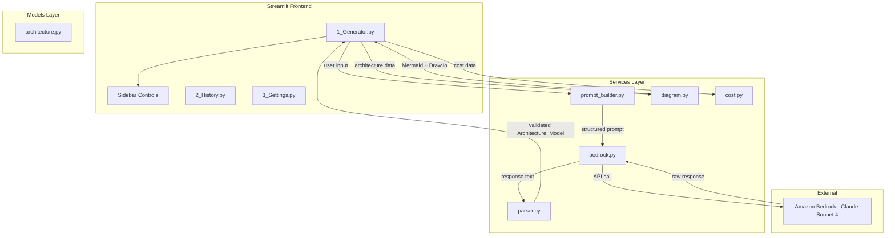
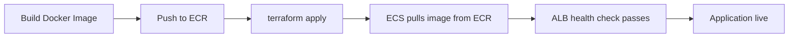

# AWS Architect AI

A Streamlit application that generates production-ready AWS architectures from natural language descriptions. Powered by Amazon Bedrock (Claude Sonnet 4), it visualizes architectures as diagrams, explains design decisions, estimates costs, and exports in multiple formats.

## Architecture



## Project Structure

```
aws-architect-ai/
├── app.py                          # Streamlit entry point
├── pages/
│   ├── 1_Generator.py             # Main generation page
│   ├── 2_History.py               # Session history viewer
│   └── 3_Settings.py              # Configuration display
├── services/
│   ├── bedrock.py                 # Amazon Bedrock client
│   ├── prompt_builder.py          # Prompt construction
│   ├── parser.py                  # Response JSON extraction & validation
│   ├── diagram.py                 # Mermaid & Draw.io generation
│   └── cost.py                    # Cost formatting
├── models/
│   └── architecture.py            # Pydantic data models
├── templates/
│   └── architecture_prompt.md     # LLM prompt template
├── utils/
│   ├── config.py                  # Environment config loader
│   ├── export.py                  # File export utilities
│   └── logging.py                 # JSON structured logging
├── tests/
│   ├── unit/                      # Unit tests
│   ├── property/                  # Property-based tests (Hypothesis)
│   └── integration/               # Integration tests
├── infra/                         # Terraform IaC for ECS Fargate
├── .streamlit/config.toml         # Streamlit server config
├── Dockerfile                     # Container image definition
├── requirements.txt               # Python dependencies (pinned)
└── .env.example                   # Environment variable template
```

## Prerequisites

- **Python 3.12** or later
- **Docker** (for containerized deployment)
- **AWS CLI v2** configured with valid credentials
- **Terraform** >= 1.0 (for infrastructure provisioning)
- An AWS account with access to **Amazon Bedrock** (Claude Sonnet 4 model enabled)

## Environment Variables

| Variable | Required | Default | Description |
|----------|----------|---------|-------------|
| `AWS_REGION` | Yes | — | AWS region for Bedrock API calls |
| `BEDROCK_MODEL_ID` | Yes | — | Bedrock model identifier (e.g., `eu.anthropic.claude-sonnet-4-5-20250929-v1:0`) |
| `AWS_PROFILE` | No | `default` | AWS CLI profile name |
| `LOG_LEVEL` | No | `INFO` | Logging level (`DEBUG`, `INFO`, `WARNING`, `ERROR`) |

Copy the example file and fill in your values:

```bash
cp .env.example .env
```

## Local Setup

### 1. Clone and install dependencies

```bash
git clone <repository-url>
cd aws-architect-ai
python -m venv .venv
source .venv/bin/activate  # On Windows: .venv\Scripts\activate
pip install -r requirements.txt
```

### 2. Configure environment

```bash
cp .env.example .env
# Edit .env with your AWS region and Bedrock model ID
```

### 3. Run the application

```bash
streamlit run app.py
```

The app will be available at [http://localhost:8501](http://localhost:8501).

## Running Tests

```bash
# Run all tests
pytest

# Run with coverage report
pytest --cov=. --cov-report=term-missing

# Run only unit tests
pytest tests/unit/

# Run only property-based tests
pytest tests/property/
```

## Docker

### Build the image

```bash
docker build -t aws-architect-ai .
```

### Run the container

```bash
docker run -p 8501:8501 \
  -e AWS_REGION=us-east-1 \
  -e BEDROCK_MODEL_ID=eu.anthropic.claude-sonnet-4-5-20250929-v1:0 \
  -e AWS_PROFILE=default \
  -e LOG_LEVEL=INFO \
  aws-architect-ai
```

The app will be accessible at [http://localhost:8501](http://localhost:8501).

### Health check

The container includes a built-in health check hitting Streamlit's internal endpoint:

```
GET http://localhost:8501/_stcore/health
```

## ECS Fargate Deployment

The `infra/` directory contains Terraform modules that provision the full AWS infrastructure:

- **VPC** with public and private subnets across 2 AZs
- **ECR** repository for Docker images
- **ECS Cluster** with Fargate capacity provider
- **ECS Service** running the container (0.5 vCPU, 1 GB RAM)
- **Application Load Balancer** with health checks
- **IAM roles** scoped to `bedrock:InvokeModel`
- **CloudWatch Logs** integration via awslogs driver

### Deployment Steps

#### 1. Configure Terraform variables

```bash
cd infra
cp terraform.tfvars.example terraform.tfvars
# Edit terraform.tfvars with your values
```

#### 2. Initialize and apply infrastructure

```bash
terraform init
terraform apply
```

Note the outputs after apply completes:
- `ecr_repository_url` — where to push your Docker image
- `alb_dns_name` — the URL to access the application

#### 3. Build and push the Docker image to ECR

```bash
# Get the ECR repository URL from Terraform output
ECR_URL=$(terraform output -raw ecr_repository_url)

# Authenticate Docker with ECR
aws ecr get-login-password --region us-east-1 | \
  docker login --username AWS --password-stdin $ECR_URL

# Build and tag
docker build -t aws-architect-ai .
docker tag aws-architect-ai:latest $ECR_URL:latest

# Push
docker push $ECR_URL:latest
```

#### 4. Deploy the new image

After pushing, ECS will automatically pick up the new image on the next deployment cycle. To force an immediate update:

```bash
aws ecs update-service \
  --cluster $(terraform output -raw ecs_cluster_name) \
  --service $(terraform output -raw ecs_service_name) \
  --force-new-deployment \
  --region us-east-1
```

#### 5. Verify

Once the ECS task is running and the ALB health check passes, the application is live at the `alb_dns_name` output URL.

### Terraform Variables

| Variable | Default | Description |
|----------|---------|-------------|
| `aws_region` | `us-east-1` | AWS region for all resources |
| `project_name` | `aws-architect-ai` | Prefix for resource naming |
| `bedrock_model_id` | `eu.anthropic.claude-sonnet-4-5-20250929-v1:0` | Model passed to ECS task |
| `container_cpu` | `512` | ECS task CPU units |
| `container_memory` | `1024` | ECS task memory (MB) |
| `log_level` | `INFO` | Application log level |
| `certificate_arn` | `""` | ACM cert ARN for HTTPS (optional) |

## Deployment Flow



## License

This project is proprietary. All rights reserved.
